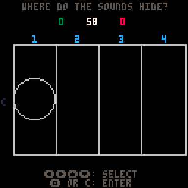
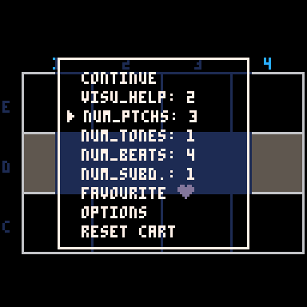

* * *

title: Battlesound  
layout: default

* * *

Battlesound ist ein Pico-8 Spiel, dass ich in erster Linie für meinen Musikunterricht entwickelt habe. Die Idee ist an das Spiel "Schiffe Versenken" ("Battleship") angelehnt, wo es darum geht, auf einem Raster Schiffe zu finden und zu versenken. In Battlesound geht es also darum, Töne auf einem Raster zu finden, die man nicht sehen, sondern nur hören kann.

Es geht also darum, das Gehör zu trainieren. Es gibt bereits viele Tools, die dieses Ziel verfolgen. Allerdings ging es mir bei der Umsetzung darum,

- Kurze Wege: In Eifer des Unterrichts ist schnelles Teilen von Inhalten sehr wichtig, um den Flow aufrecht zu erhalten.
- Kein Schnickschnack: Meiner Erfahrung nach, ist ein großer Nachteil vieler digitaler Medien, dass Sie überfrachtet sind. Das hat zur Folge, dass Schüler entweder abgelenkt werden, oder nicht sofort erkennen, worum es gerade eigentlich geht.
- Skalierbarkeit: ich habe mit sehr heterogenen Gruppen zu tun. Manche meiner Schüler haben schon Probleme damit zu verstehen, wie Zählzeiten in der Musik funktionieren. Andere bringen bereits Erfahrungen mit, die weit darüber hinaus gehen.
- Einfache bedienung
- Flow

&nbsp;

&nbsp;

[639893main_Good_Picture_of_Steve.mp3](../_resources/639893main_Good_Picture_of_Steve.mp3)

[C0113.MP4](../_resources/C0113.MP4)