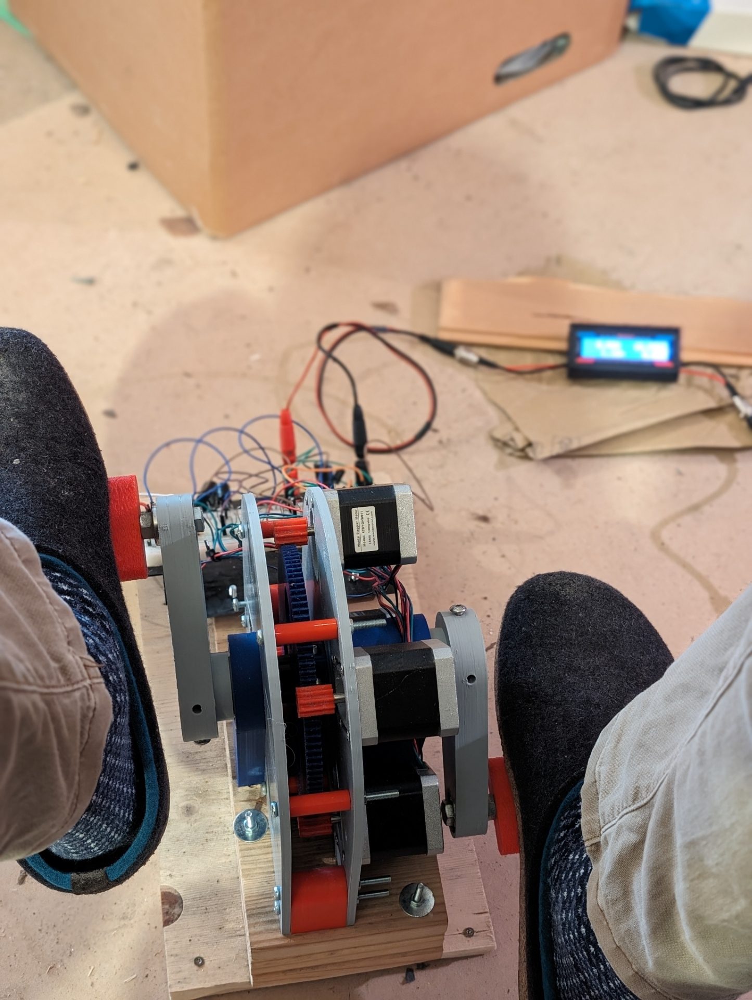

Wenn es windstill ist und die Sonne nicht scheint, ist Muskelkraft gefragt, sofern man seinen Strom selbst erzeugen und nichts anzünden möchte (oder habe ich etwas vergessen?). Ich habe diesen Generator aus Neugier gebaut, aber auch weil ich die Idee mag, meinen Laptop während der Nutzung durch Padalieren aufzuladen - also Nerdyness mit Fittnes zu verbinden.

Der Generator basiert auf Nema 17 Steppermotoren, weil sie einerseits recht günstig sind, und zum Anderen gelten sie, [verglichen](https://youtu.be/cJ_vDA7xsGs?si=5OKRyAfqR_R4vbK4) mit anderen potenziellen Kandidaten als recht effizient.

Der Generator ist recht modular aufgebaut. Das gilt einerseits für die Konstruktion, die mit der CAD-Programmiersprache openSCAD erstellt wurde. Zum Anderen kan man dien Generator skalieren, indem man die Anzahl der Nema 17 Motoren variiert. Es können bis zu 8 Motoren verbaut werden.

[1-Gitarre_Track 62.mp3](../_resources/1-Gitarre_Track%2062.mp3)

Bei der ersten Version des Generators verwendete ich eine M8-Gewindestange als Achse und Skateboeardkugellager, umden Materialbedarf möglichst einfach zu halten. Das hatte zu mehren Problemen geführt. Zum einen war es ziemlich schwierig, die Kurbeln genau 180 zueinander auszurichten. Zum anderen reichten die 8mm nicht für eine stabile Achse.

Eine 12mm Achse wäre vermutlich stabil genug gewesen, allerdings hätte ich dann imernoch das Poblem gehabt, die Kurbeln einfach und zuverlässig gerade auszurichten. Deswegen verwende ich nun ein standard 20 mm starkes Aluminium-Profil. Weil es nicht rund ist, hat es etwas länger gedauert, bis ich auf die Idee gekommen bin. Aber eine Achse muss nicht rund sein, sofern man sie in ein Kugellager durch eine entspreche Form einpassen kann. Mit nem 3d-Drucker ist das natürlich kein Problem. Es hat den Vorteil, dass ich micht keine Gedanken mehr darüber machen muss, wie man Kurbeln an einer runden Achse so befestigt, dass sie sich nicht verdrehen können.

\---Foto Kurbel mit Achse---

## Performance

Ich habe wenig Vergleichsmöglichkeiten, weswegen es mir etwas schwer fällt, die Leistungsausbeute einzuordnen. Mit vier Steppermotoren erreiche ich bei langsamen Treten ca 10 und bei schnellerem 20 Watt. Mit den Händen komme ich bei vollem Einsatz maximal 30 Watt heraus. Meinetwegen dürfte es gerne etwas mehr sehr sein, aber mein Ziel, meinen Laptop währen der Nutzug durch Pedalieren mit ausreichend Strom zu versorgen, habe ich immerhin erreicht, sofern ich damit nicht Zocken möchte. Es wäre interessant zu wissen, wie viel Strom ich mit einem komplett eigenen Generator-Design, also mit selbstgewickelten Spulen und Magneten, erzeugen könnte. Eine Andere Stellschraube wäre es, mehr als vier Steppermotoren einzusetzen. Das allerdings würde den ohnehin schon großen Schaltungsaufwand

## Elektronik

Um den in den Steppermotoren erzeugten Strom Wechselstrom nutzbar zu machen, werden pro Motor zwei Gleichrichter benötigt, da diese über jeweils zwei Spulen verügen. Das macht 8 Gleichrichter, die ich aus jeweils vier Dioden gebaut habe. Je nachdem, wie ich wie diese Gleichrichter miteinander verschaltet sind, kann man die mögliche Ausgangsspannung beeinflussen.
